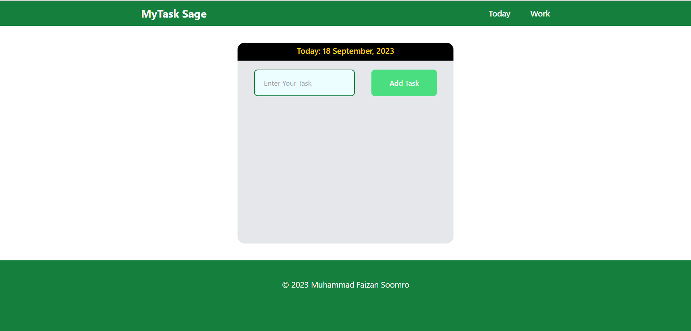
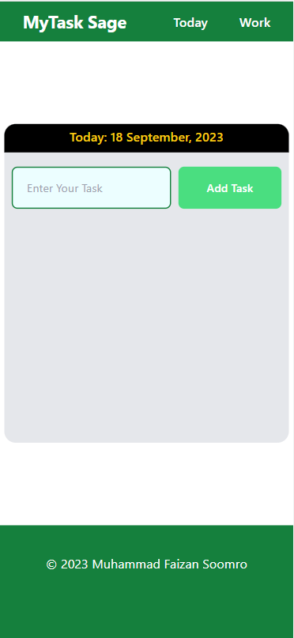

# MyTask Sage

Empower Your Productivity with MyTask Sage: Your Ultimate Task Manager!"

## Table of contents

- [Overview](#overview)
  - [Screenshot](#screenshot)
  - [Links](#links)
  - [How to run](#how-to-run)
- [My process](#my-process)
  - [Built with](#built-with)
  - [What I learned](#what-i-learned)
  - [Useful resources](#useful-resources)
- [Author](#author)

## Overview

### Screenshot

## Desktop

## Mobile

### Links

- Live Site URL: [Website](https://tasksage.cyclic.cloud/)

### How to run

- Download the project and open it.
- run  `npm install`, it will install all dependencies. Make sure you already have NodeJS installed.
- run the server using `node index.js`. ENJOY!

## My process

### Built with

- Semantic HTML5 markup
- CSS custom properties
- Flexbox
- CSS Grid
- Mobile-first workflow
- [Tailwind CSS](https://tailwindcss.com/) - CSS Framework
- [jQuery](https://jquery.com/) - JS Library
- [NodeJS](https://nodejs.org/en)
- [ExpressJS](https://expressjs.com/) - NodeJS Framework
- [EJS](https://ejs.co/) - JS Templating Language.
- [MongoDB](https://www.mongodb.com/) - Database.
- [Mongoose](https://mongoosejs.com/).

### What I learned

Through this project, I was able to strengthen my grip on various NodeJS concepts and revised previous concepts too especially Frontend. I also learned to use mongoDB with mongoose.

### Useful resources

- [Flexbox Revision](https://css-tricks.com/snippets/css/a-guide-to-flexbox/) - Amazing website to revise CSS Flexbox concepts.
- [Grid Revision](https://css-tricks.com/snippets/css/complete-guide-grid/) - Amazing website to revise CSS Grid concepts.
- [Stack overflow](https://stackoverflow.com/) - To get help with NodeJS errors.
- [W3Schools](https://www.w3schools.com/) - To get help with syntax and revising few concepts.
- [Mongoose Docs](https://mongoosejs.com/docs/guide.html) - To get help with mongoose.

## Author

- GitHub - [Muhammad Faizan Soomro](https://github.com/Muhammad-Faizan-Soomro/)
- Twitter - [@faizannsoomro](https://www.twitter.com/faizannsoomro)
- Linkedin - [Muhammad Faizan Soomro](https://www.linkedin.com/in/faizansoomro/)
